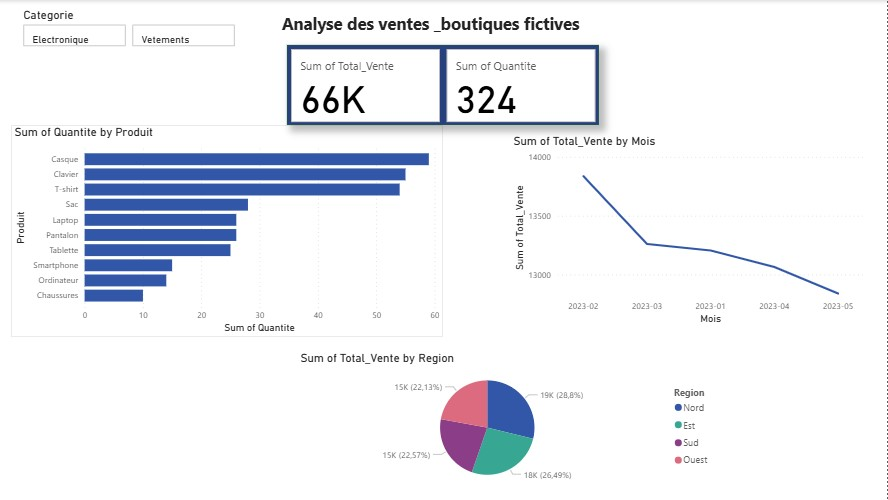
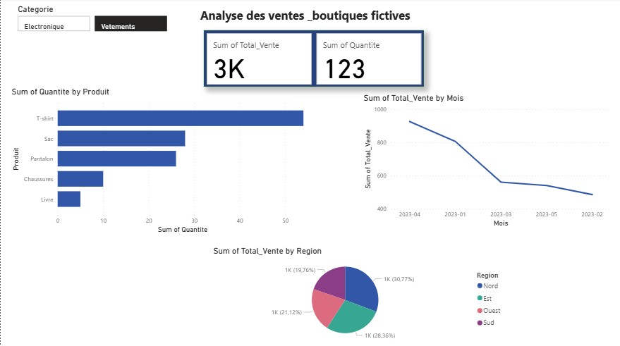
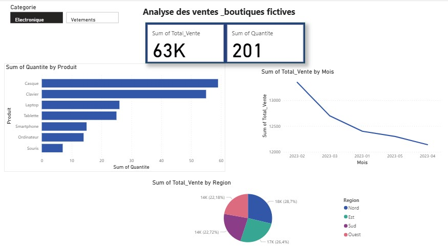

# 📊 Analyse des Ventes - Dashboard

Ce projet présente une analyse détaillée des ventes à travers trois dashboards interactifs.

## 🚀 Aperçu des Dashboards

### 1️⃣ Dashboard Générale
*Analyse globale du chiffre d'affaires et des indicateurs clés (KPIs).*

---

### 2️⃣ Dashboard des Vêtements
*Focus sur les performances de la catégorie Mode et Vêtements.*

---

### 3️⃣ Dashboard des Électroniques
*Suivi des ventes des produits technologiques et gadgets.*

## 🛠️ Compétences et Outils
* **Traitement de données** : Nettoyage et préparation avec **Python** (Pandas).
* **Analyse de données** : Exploration des tendances de ventes et calcul des KPIs.
* **Visualisation** : Création de tableaux de bord interactifs avec **Power BI** (ou Python).
* **Gestion de projet** : Utilisation de Git et GitHub pour le versioning.
  
## Fichiers dans le dépôt
* `analyse_ventes.py`: Script Python pour le traitement des données.
* `ventes_fictives.csv`: Jeu de données utilisé pour l'analyse.
